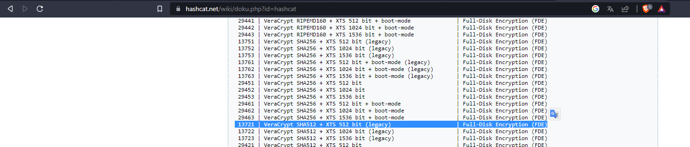

# Introduction
---

KerryCopo is an easy/medium CTF machine that showcase **wordlists, password cracking, metadata, enumeration, encrypted volumes and steganography**. There are 2 flags, **user_flag.txt** and **root_flag.txt**.

You can get it [here]!

I hope you like it, so if it is the case I would like to know.

I created this machine for a friend for his birthday, and today I would like to share It with the community.

Below this you can find a WriteUp of the machine.


---
---

## WriteUp
---

Start scanning the machine.

```bash
nmap -sSV -p- --min-rate 10000 <IP> -oN <output file>
```


We can see there are two ports open, port 22 (ssh) and port 80 (http).

If we go to the website. We find the family page and a little description.


If we click in **SQL**, It redirects us to an under construction page.


Searching in the index page code, we can see and interesting comment.


Let's download it for use it in the future.


Like in the code there is nothing interesting, let's try to enumerate files and directories.

```bash
gobuster dir -u http://<IP>/ -w /usr/share/wordlists/dirbuster/directory-list-2.3-medium.txt -q -t 40 -x html,php,txt
```


The enumerating throw one interesting file called **about.php**.
Let's go to the page.

We can see there is a form to submit queries in SQL and there is a comment that says the name of the table.


Let's try to do a select query to see all the data.


The content is interesting, because it throws the usernames and some interesting data from each.


Like we read before, kerry is newbie on developing web so let's try if we can show the tables of the database.


We can! And there is another table called **family_user**


It's time to see the content of the **family_user** table.


It seems that we get a username and a password hash.


The hash seems to be **SHA1**.


Let's try to crack it with the wordlist we saw in the page comment.

```bash
john --format=RAW-SHA1 <file> --wordlist=<path to kaonashi14M.txt>
```

We got the password, now is time to connect with the credentials.


```bash
ssh kerry@<IP>
```


We are in!

Let's list the files.

```bash
ls -la
```

There is a file interesting called **john.dic**, It seems to be a dictionary so We're going to download it.


Let's use python for this task and open a http server in the actual directory.

```bash
python3 -m http.server
```


Searching a little, We can see there is a cron task running under the user copo.

```bash
cat /etc/crontab
```


And if We see the permissions of **/etc/hosts** we can modify it.

Let's take advantage of this and change the Ip from **thefam.com**.

```bash
ls -la /etc/hosts
cat /etc/hosts
```


First let's make the directory on our local machine.

```bash
mkdir download
```


And then write the revshell in a file called **script.sh** inner the directory we made.

```bash
cat script.sh
```


Let's serve it in the port 80 with the help of python.

```bash
python3 -m http.server 80
```


And put a netcat listener.

```bash
nc -lvnp 4444
```


We modify the **/etc/hosts**.

```bash
nano /etc/hosts
```


And if all is correct, We get the connection with the user **copo**.


Time to list the actual directory.

```bash
ls -la
```


There are two files interesting **About john.eml** and **jack.jpg**.

Let's show the mail content.

```bash
cat "About john.eml"
```

We can see the data is enconded in base64 so let's decode it.


We can us [CyberChef] for it.

Copo talk about an encrypted volume with **AES SHA 512**, possibly this information will be important in the future.


Let's download **jack.jpg**.

```bash
python3 -m http.server
```


Like we read in the hobbies before, let's see the metadata of the image.

```bash
exiftool jack.jpg
```

And there is an interesting row that seems to be encoded with base64.


Let's use CyberChef again to decode It, but seems to be encoded in ROT too.


Time to try different rotations and the 20 return an interesting path.


Let's go to this path.

```bash
cd /var/log/apache2/xcvv
ls
```

There is a file called **i**.


If we show the content, It seems to be a script.

```bash
cat i
```


Time to execute it.

```bash
bash i
```

And the result is the john id_rsa.


Time to connect with the user john and using the id_rsa we get.

```bash
ssh -i <id_rsa file> john@<IP>
```
We are in!


Let's list the actual directory.

There are 3 interesting files **john-vol**, **user_flag.txt** and **veracrypt.deb**

```bash
ls -la
```


We get the first flag!

```bash
cat user_flag.txt
```


Let's download **john-vol**. It seems to be an encrypted veracrypt volume.

```bash
python3 -m http.server 8001
```


With all the information we got before, It's time to crack this volume.

Like we saw, It is a simple 512 bits veracrypt sha512 so we need to use **13721** to crack it and with the **dictionary that we downloaded from kerry**.



```bash
hashcat -a 0 -w 4 -t 60 -m 13721 <path to john-vol> <path to john.dic>
```


We got the password, It's time to mount the volume.


There are a lot of directories with numbers.

```bash
ll
```


Time to tree all the directories for find something interesting.

```bash
ls -laR | more
```


Searching a little we find a file called **note.txt** in **/1887/j/a/c/k/t/h/e/**.


The note content, some data encoded.

```bash
cat note.txt
```


It seems to be a vigenere cipher, but we don't have the key, so let's use Cryptanalysis to search the length of the key.


Trying to decrypt with the key-length of 4, We got some interesting.

**The magic word is: kn1v3**


Searching a little more we find an image called **knive.jpg** in **/1891/r/i/p/p/e/r/**.


When we see, the image is a little strange but there is nothing interesting.

Like we read in the hobbies before, John likes steganography, so let's try to extract something from the image.


With the note, we got the magic word, so we'll use it as the password for the extraction.

```bash
steghide extract -sf <path to knive.jpg>
```

And we got a file called **pass.txt**.


Time to show the content from the file.

```bash
cat <path to pass.txr>
```

It seems to be a hexadecimal code.


Let's decode It with CyberChef and we got John password.


Time to elevate our privileges knowing john password.

```bash
sudo su
```


If We go to the root directory and list It we got the last flag!

```bash
ls
cat root_flag.txt
```

And We've finished the machine!


[CyberChef]:https://gchq.github.io/CyberChef/
[here]:https://hub.docker.com/r/4p0f1s/kerrycopo-ctf
